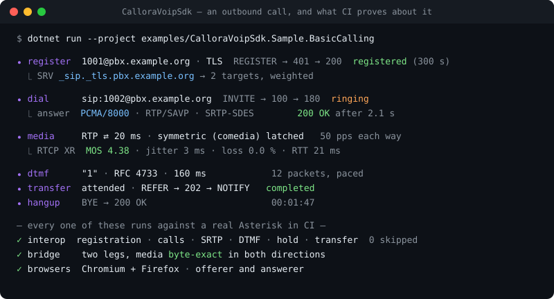

<div align="center">

# CalloraVoipSdk

**Put a real telephone in a .NET application.** SIP signalling, RTP/SRTP media, WebRTC and a
self-hostable STUN/TURN server — one facade, no native dependencies.

[](https://github.com/BechsteinDigital/callora-voip-sdk/actions/workflows/ci.yml)
[](https://www.nuget.org/packages/CalloraVoipSdk.Core)
[](https://www.nuget.org/packages/CalloraVoipSdk.Core)
[](#compatibility)
[](LICENSE)
[](https://bechsteindigital.github.io/callora-voip-sdk/)

<p align="center">
  
</p>

</div>

---

## Thirty seconds

```bash
dotnet add package CalloraVoipSdk
dotnet add package CalloraVoipSdk.Audio.Linux   # or .Audio.Windows
```

```csharp
using CalloraVoipSdk;
using CalloraVoipSdk.Core.Domain.Lines;

using var client = new VoipClient();

var connected = await client.ConnectAsync(new SipAccount
{
    Username  = "1001",
    Password  = "secret",
    SipServer = "pbx.example.org",
});

var dialed = await client.DialAndWaitUntilConnectedAsync(
    connected.Line!, "sip:1002@pbx.example.org");

await client.AttachDefaultAudioAsync(dialed.Call!);
```

A registered line, a connected call, live audio on the machine's default devices. Both results carry
a status you should check rather than the `!` used here for brevity — a call that nobody answered is
not an exception, it is an outcome.

Everything below is what happens when you need more than that.

## Why this one

**It is checked against real software, not against itself.** Every CI run boots an **Asterisk
(PJSIP)** container and runs the matrix through it — registration, in- and outbound calls with live
RTP, codec negotiation, SRTP-SDES, DTMF, hold, blind and attended transfer, session timers, early
media, TCP/TLS — plus a two-leg bridged call whose media is verified **byte-exact in both
directions**. The WebRTC side runs against **Chromium and Firefox** (headless, via Playwright) with
the SDK as offerer *and* as answerer, and the TURN server against a real **coturn**.

**The limits are written down.** A protocol library that only advertises what works is a library you
find the edges of in production. [What is proven, and what is not](#status) is a section, not a
footnote.

**Three depths, mixable per call.** Most libraries make you choose once between a black box and a raw
protocol stack. Here the levels sit on top of each other, and using the easy one does not close off
the others:

| Depth | What you use | For |
| --- | --- | --- |
| Managed workflows | `ConnectAsync`, `DialAndWaitUntilConnectedAsync`, default audio, playback | Softphones, dialers, ordinary call flows |
| Typed call control | `IPhoneLine`, `ICall`, transfer, DTMF, in-dialog SIP, negotiated media, quality and ICE state, custom headers | Contact-centre logic, routing, diagnostics |
| Media and extension seams | `IMediaReceiver`, `IMediaSender`, `MediaConnector`, your own `IAudioDevice`, `ModuleRegistry` | Voice bots, custom routing, observability, separately shipped modules |

What stays internal stays internal: SIP and RTP implementation classes, and arbitrary mutation of the
wire. Controlled extensibility rather than an unstable stack with the lid off.

**No native dependencies for the protocol stack.** Managed C# end to end, so it runs where .NET runs.
Audio devices are the exception and live in their own packages.

## What it does

<table>
<tr><td valign="top" width="50%">

**SIP**
- Registration with digest auth (MD5 and SHA-256), NAT rport, DNS SRV/NAPTR
- Inbound and outbound calls, hold, re-INVITE, UPDATE
- Blind and attended transfer (REFER, RFC 3515)
- SUBSCRIBE/NOTIFY, PUBLISH, MESSAGE, INFO, PRACK
- Session timers (RFC 4028), early media (RFC 3960)
- UDP, TCP, TLS, WS, WSS

</td><td valign="top" width="50%">

**Media**
- G.711 µ-law/A-law, G.722, Opus; RFC 4733 DTMF
- Adaptive jitter buffer with loss concealment
- RTCP sender/receiver reports and **RTCP XR VoIP metrics** (MOS, burst/gap)
- SRTP via SDES and DTLS-SRTP, with replay windows on RTP and RTCP
- Symmetric RTP (comedia) for NAT
- Per-call media taps: attach frame receivers and senders to any call

</td></tr>
<tr><td valign="top">

**WebRTC**
- Peer connections, offer/answer, trickle ICE, ICE restart
- Audio and VP8/H.264 video, BUNDLE, multi-track
- Receive-side simulcast, recording taps
- Browser-verified in CI against Chromium and Firefox

</td><td valign="top">

**Connectivity**
- STUN and TURN **client**
- STUN/TURN **server** you can host yourself
- UDP relay, plus TCP/TLS relay for networks that only allow 443
- ICE consent freshness (RFC 7675)

</td></tr>
</table>

Full API reference: **[bechsteindigital.github.io/callora-voip-sdk](https://bechsteindigital.github.io/callora-voip-sdk/)**

## Status

The line between "we run this in production" and "this compiles and has tests" is where most
integration time goes, so it is drawn here.

| Area | State | What that means |
| --- | --- | --- |
| SIP + RTP core | **Production-proven** | Exercised end to end against a real Asterisk in every CI run, zero skipped cases in the matrix |
| SRTP (SDES) | **Production-proven** | Same matrix, real PBX |
| WebRTC audio + video | **Browser-verified** | Chromium and Firefox in CI, SDK as offerer and answerer, 1 audio + 1 video |
| UDP TURN relay | **Production-proven** | End to end against real coturn |
| TCP/TLS TURN relay | **Unit-proven** | Data path against a real server is still in the interop matrix — validate before relying on it |
| Full ICE (RFC 8445) | **Opt-in** | Symmetric RTP is the proven NAT path; validate ICE for your trunk before switching |
| Multi-track topologies | **Transport-only** | The primitives are stable; the browser matrix covers one audio and one video track |
| Data channels (SCTP) | **Not implemented** | No timeline; open an issue if you need them |
| G.729 | **Negotiable, not decodable** | The format can be negotiated and forwarded; this SDK carries no G.729 implementation |

Known gaps and interop defects are tracked in the [issue tracker](../../issues). Interop reports from
a carrier or a device we have not seen are the single most useful contribution.

## Packages

| Package | What it is |
| --- | --- |
| [`CalloraVoipSdk`](https://www.nuget.org/packages/CalloraVoipSdk) | The facade. Start here. |
| [`CalloraVoipSdk.Core`](https://www.nuget.org/packages/CalloraVoipSdk.Core) | Calls, lines, media and protocol contracts |
| [`CalloraVoipSdk.Audio.Windows`](https://www.nuget.org/packages/CalloraVoipSdk.Audio.Windows) | Windows audio devices (NAudio) |
| [`CalloraVoipSdk.Audio.Linux`](https://www.nuget.org/packages/CalloraVoipSdk.Audio.Linux) | Linux audio devices (PortAudio) |

Headless services need no audio package at all — media flows through streams and taps.

## Examples

Runnable projects in [`examples/`](examples), roughly in order of depth:

| | |
| --- | --- |
| [BasicCalling](examples/CalloraVoipSdk.Sample.BasicCalling) | Register, dial, answer |
| [Dialer](examples/CalloraVoipSdk.Sample.Dialer) | Outbound campaign over one line |
| [Transfer](examples/CalloraVoipSdk.Sample.Transfer) | Blind and attended |
| [Switchboard](examples/CalloraVoipSdk.Sample.Switchboard) | Several calls at once, bridged |
| [CustomAudio](examples/CalloraVoipSdk.Sample.CustomAudio) | Your own source and sink instead of a device |
| [VideoCalling](examples/CalloraVoipSdk.Sample.VideoCalling) | SIP video with a codec you bring |
| [WebRtcPeer](examples/CalloraVoipSdk.Sample.WebRtcPeer) · [DI](examples/CalloraVoipSdk.Sample.WebRtcDependencyInjection) · [Recording](examples/CalloraVoipSdk.Sample.WebRtcRecording) | The WebRTC facade |
| [WebRtcVideoCall.Web](examples/CalloraVoipSdk.Sample.WebRtcVideoCall.Web) | A browser video call, end to end |

## Compatibility

**net8.0, net9.0, net10.0.** Windows, Linux and macOS for the protocol stack; audio devices on
Windows and Linux.

**Versioning is [SemVer](https://semver.org/), and the public surface is a tracked file.** Every
public type and member lives in `PublicApi.approved.txt`, and a CI gate fails the build when a change
is not reflected there — so a breaking change is a reviewable diff rather than something a consumer
discovers after upgrading.

Per-release detail lives in [`docs/release-notes/`](docs/release-notes); the machine-readable list is
[`CHANGELOG.md`](CHANGELOG.md).

## Building it yourself

```bash
git clone https://github.com/BechsteinDigital/callora-voip-sdk.git
cd callora-voip-sdk
dotnet test tests/CalloraVoipSdk.ArchitectureTests   # the gates CI runs first
dotnet test                                          # the standard set
```

The Asterisk and browser interop suites need a Docker daemon and self-skip without one. Maintainer
workflows, the architecture map and the invariants are in [`MAINTAINING.md`](MAINTAINING.md); the
rules the tests enforce are in [`ENGINEERING_RULES.md`](ENGINEERING_RULES.md).

## Contributing

Bug reports, interop feedback and pull requests are welcome — see
[`CONTRIBUTING.md`](CONTRIBUTING.md) and the [`CODE_OF_CONDUCT.md`](CODE_OF_CONDUCT.md).

Found a security issue? Do not open an issue — [`SECURITY.md`](SECURITY.md) says where to send it.

## License

[Apache-2.0](LICENSE). Third-party components are listed in
[`THIRD-PARTY-NOTICES.md`](THIRD-PARTY-NOTICES.md).

<div align="center">
<sub>Built by <a href="https://bechstein.digital">Bechstein Digital</a> ·
<a href="https://ko-fi.com/bechsteindigital">Support the project</a></sub>
</div>
